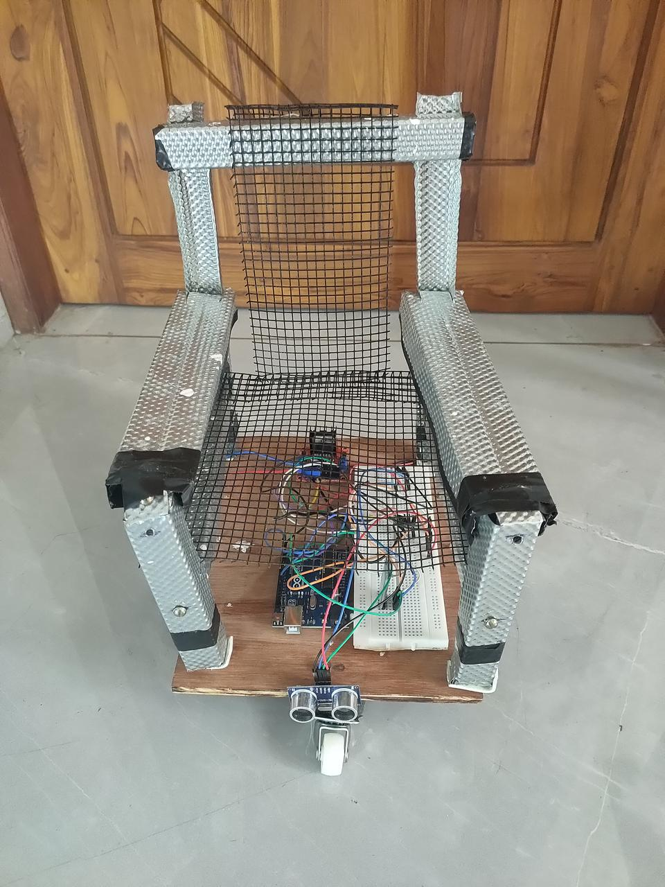

# Eye-Controlled Wheelchair

[](https://choosealicense.com/licenses/mit/)
[](https://www.python.org/downloads/)
[](https://www.arduino.cc/)

An assistive technology project enabling wheelchair control through eye movements using computer vision and Arduino. This system empowers individuals with severe mobility impairments to navigate independently using intuitive eye gestures.

## 📋 Table of Contents
- [Overview](#overview)
- [Features](#features)
- [Hardware Components](#hardware-components)
- [Software Requirements](#software-requirements)
- [System Architecture](#system-architecture)
- [Installation](#installation)
- [Usage](#usage)
- [How It Works](#how-it-works)
- [Project Structure](#project-structure)
- [Results](#results)
- [Contributors](#contributors)
- [Acknowledgments](#acknowledgments)
- [License](#license)

## 🎯 Overview

This project implements a hands-free wheelchair control system that uses real-time eye tracking to translate gaze direction and eye gestures into movement commands. Developed as a B.Tech final year project at College of Engineering Thalassery (2024-25), it demonstrates the potential of affordable assistive technology.

**Key Innovations:**
- Non-invasive video-based eye tracking
- Real-time obstacle detection and avoidance
- Voice feedback for enhanced user experience
- Cost-effective solution (₹2,520 total)

## ✨ Features

- **Real-Time Eye Tracking**: 25 FPS processing using dlib facial landmark detection
- **Intuitive Control**: 
  - Gaze left/right for turning
  - Gaze center for forward movement
  - Sustained eye closure (1.5s) to start/stop
- **Safety First**: 
  - Ultrasonic obstacle detection (2-50 cm range)
  - Automatic emergency stop at <20 cm
  - Warning alerts at 20-50 cm
- **User Feedback**: Voice announcements for all actions
- **Wireless Communication**: HC-05 Bluetooth module (9600 baud)
- **Reliable Navigation**: Differential steering with DC gear motors

## 🔧 Hardware Components

| Component | Specification | Quantity | Cost (INR) |
|-----------|---------------|----------|------------|
| Arduino Uno | ATmega328P, 16 MHz | 1 | ₹500 |
| L298N Motor Driver | 2A/channel, 12V | 1 | ₹150 |
| DC Gear Motors | 110 RPM, 12V | 2 | ₹320 |
| HC-SR04 Ultrasonic | 2-400 cm range | 2 | ₹300 |
| HC-05 Bluetooth | 10m range | 1 | ₹340 |
| Lead-Acid Battery | 15V, 3000 mAh | 1 | Included |
| Chassis & Wheels | - | 1 set | ₹600 |
| Miscellaneous | Wires, sensors | - | ₹310 |
| **Total** | | | **₹2,520** |

## 💻 Software Requirements

- **Python 3.8+** with libraries:
  - OpenCV (`cv2`)
  - dlib
  - NumPy
  - pyserial
  - pyttsx3 (text-to-speech)
- **Arduino IDE** for microcontroller programming
- **dlib shape predictor**: `shape_predictor_68_face_landmarks.dat`

## 🏗️ System Architecture

```
┌─────────────────┐        Bluetooth        ┌──────────────────┐
│  Laptop Camera  │◄──────────────────────►│   Arduino Uno    │
│  (Eye Tracking) │      (9600 baud)       │  (Motor Control) │
└────────┬────────┘                        └────────┬─────────┘
         │                                          │
         │ Python Processing                        │ PWM Signals
         │ - Face Detection                         │
         │ - EAR Calculation                        ▼
         │ - Gaze Detection               ┌──────────────────┐
         │                                │  L298N Driver    │
         └──────────► Commands            └────────┬─────────┘
           (F/L/R/S)                               │
                                                   ▼
                                          ┌──────────────────┐
                                          │   DC Motors      │
                                          │  (Left + Right)  │
                                          └──────────────────┘
```

## 📦 Installation

### 1. Clone the Repository
```bash
git clone https://github.com/YourUsername/Eye-Controlled-Wheelchair.git
cd Eye-Controlled-Wheelchair
```

### 2. Install Python Dependencies
```bash
pip install opencv-python dlib numpy pyserial pyttsx3
```

### 3. Download Face Landmark Model
Download `shape_predictor_68_face_landmarks.dat` from [dlib's model repository](http://dlib.net/files/shape_predictor_68_face_landmarks.dat.bz2) and place it in the `python/` directory.

### 4. Upload Arduino Code
Open `arduino/wheelchair_control.ino` in Arduino IDE and upload to your Arduino Uno.

### 5. Configure Serial Port
Update the COM port in `python/eye_tracking.py`:
```python
ser = serial.Serial('COM4', 9600, timeout=1)  # Change COM4 to your port
```

## 🚀 Usage

1. **Hardware Setup**: 
   - Connect all components as per circuit diagram (see `docs/circuit_diagram.png`)
   - Ensure battery is charged and connections are secure

2. **Start the System**:
   ```bash
   cd python
   python eye_tracking.py
   ```

3. **Calibration**:
   - Position yourself 30-50 cm from the camera
   - Ensure good lighting conditions
   - Wait for face detection confirmation

4. **Control Commands**:
   - **Start**: Close eyes for 1.5 seconds
   - **Forward**: Look at center of screen
   - **Left Turn**: Look left
   - **Right Turn**: Look right
   - **Stop**: Close eyes for 1.5 seconds again

5. **Exit**: Press 'q' in the video window

## 🔍 How It Works

### Eye Aspect Ratio (EAR)
The system uses EAR to detect eye closure:

```
EAR = (|p2 - p6| + |p3 - p5|) / (2 * |p1 - p4|)
```

Where p1-p6 are eye landmark coordinates. EAR < 0.25 indicates closed eyes.

### Gaze Direction Detection
1. Extract eye region from facial landmarks (points 36-47)
2. Apply binary thresholding to isolate pupil
3. Calculate pupil centroid using contour detection
4. Classify position:
   - Left: x < 30% of eye width
   - Center: 30% ≤ x ≤ 70%
   - Right: x > 70%

### Motor Control Logic
| Gaze Direction | Left Motor | Right Motor | Result |
|----------------|------------|-------------|---------|
| Center | Forward | Forward | Move Forward |
| Left | Reverse | Forward | Turn Left |
| Right | Forward | Reverse | Turn Right |
| Eyes Closed | Stop | Stop | Stop/Start Toggle |

## 📁 Project Structure

```
Eye-Controlled-Wheelchair/
├── arduino/
│   └── wheelchair_control.ino      # Motor control & sensor code
├── python/
│   ├── eye_tracking.py             # Main eye tracking script
│   └── shape_predictor_68_face_landmarks.dat
├── docs/
│   ├── circuit_diagram.png         # Wiring schematic
│   ├── project_report.pdf          # Full technical report
│   └── system_images/              # Photos of implementation
├── videos/
│   └── demo.mp4                    # System demonstration
├── README.md
└── LICENSE
```

## 📊 Results

- **Processing Speed**: 25 FPS (real-time)
- **Face Detection Latency**: <50 ms
- **Command Execution**: <100 ms via Bluetooth
- **Eye Tracking Accuracy**: 95%
- **False Positive Rate**: <2%
- **Obstacle Detection Range**: 2-50 cm (critical stop at <20 cm)

## 👥 Contributors

**College of Engineering Thalassery - Batch 2024-25**

- **Muhammed Adnan Yakoob** (TLY21EC051)
- **Nithish Narayana** (TLY21EC063)
- **Jishnujith K** (TLY21EC042)
- **Midhul P N** (TLY21EC048)

**Project Guide**: Prof. Shayini R (Assistant Professor, Dept. of ECE)

## 🙏 Acknowledgments

We express our sincere gratitude to:
- Dr. Sudheer V.R, Head of Department, ECE
- Prof. Deepthy Mathew, Project Coordinator
- APJ Abdul Kalam Technological University
- College of Engineering Thalassery

## 📄 License

This project is licensed under the MIT License - see the [LICENSE](LICENSE) file for details.

## 📞 Contact

For questions or collaboration opportunities:
- GitHub Issues: [Report a bug](https://github.com/YourUsername/Eye-Controlled-Wheelchair/issues)
- Email: [Contact contributors via GitHub]

---

**Note**: This is an academic project designed for educational purposes. Clinical implementation would require additional safety certifications and medical device approvals.


## 📸 Project Gallery

### System Implementation

**👉 TO ADD IMAGES:** Click the edit button (pencil icon) above, then drag and drop your images or press Ctrl+V to paste them directly here!

<!-- Paste your system prototype image below -->


<!-- Add more system implementation photos here -->
<!-- Example:  -->

### Circuit Diagrams

<!-- Add your circuit diagram images here -->
<!-- Example:  -->

### Eye Tracking Demo

<!-- Add eye tracking demonstration screenshots/photos here -->
<!-- Example:  -->

### Hardware Components

<!-- Add photos of individual hardware components here -->
<!-- Example:  -->
<!-- Example:  -->

### Video Demonstrations

📹 **Demo Videos:** Upload your demonstration videos to the `docs/videos/` folder

Once uploaded, you can link them here:
```markdown
[Watch Demo Video](docs/videos/demo.mp4)
```

Or embed if hosted on YouTube/Vimeo:
```markdown
[](https://www.youtube.com/watch?v=YOUR_VIDEO_ID)
```

## 🔮 Future Enhancements

- Machine learning for improved gaze accuracy
- Multi-user profile support
- Speed control via blink patterns
- Integration with smart home devices
- Mobile app for remote monitoring

---

⭐ **If this project helps you, please consider giving it a star!**
